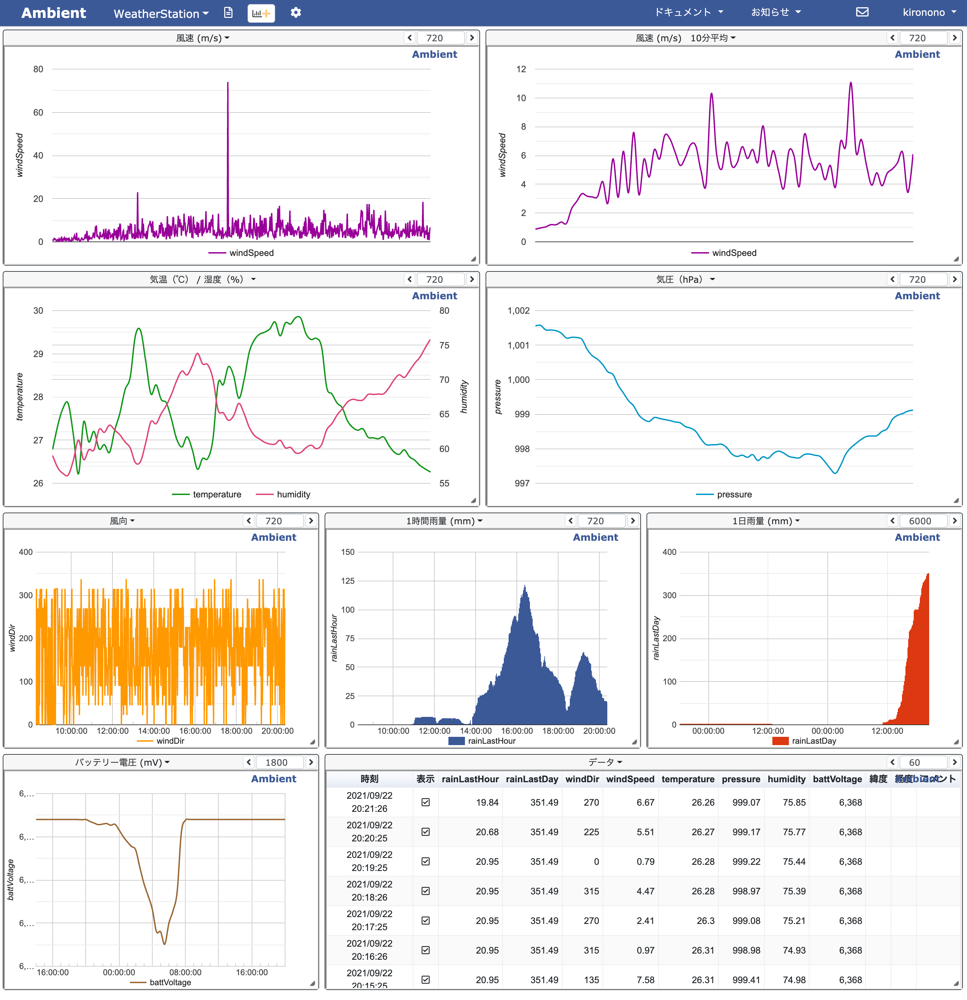

# Home-Weather-Station

Home-use meteorological observation device using ESP32.

## Development platform

PlatformIO

## Used hardware

* [ESPr® Developer 32](https://www.switch-science.com/catalog/3210/)
* [Weather Meter Kit](https://www.switch-science.com/catalog/6221/)
* [BME280 Module](https://www.switch-science.com/catalog/2236/)

## Dashboard

The acquired sensor data is sent to [Ambient](https://ambidata.io/). You can build a dashboard like the one below.

## License

`Home-Weather-Station` is distributed under the terms of the MIT license.

See the [LICENSE](LICENSE) files in this repository for more information.
